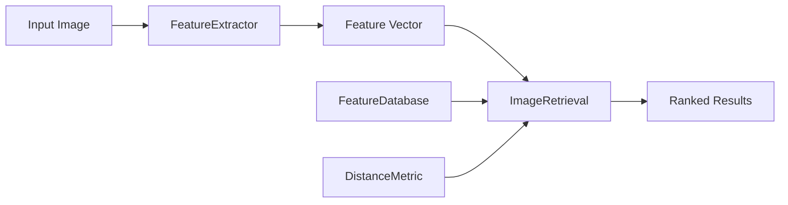

# Content-Based Image Retrieval (CBIR) System

**Author:** Krushna Sanjay Sharma  
**Course:** CS 5330 - Computer Vision  
**Date:** February 2026

---

## Project Overview

This project implements a comprehensive Content-Based Image Retrieval (CBIR) system that matches images based on visual features rather than metadata. The system supports multiple feature extraction methods, from simple baseline approaches to advanced deep learning embeddings, and includes an interactive Python GUI for easy querying.

### Key Features

- **Multiple Feature Extractors:**
  - Baseline (7×7 center square)
  - RGB Histogram
  - RG Chromaticity Histogram
  - Multi-Region Histogram (2×2 grid)
  - Texture + Color (Sobel gradients)
  - Gabor Texture + Color (advanced)
  - ResNet-18 DNN Embeddings
  - ProductMatcher (DNN + center-region color)
  - FaceAware (adaptive face-based features)

- **Distance Metrics:**
  - Sum of Squared Differences (SSD)
  - Histogram Intersection
  - Multi-Region Histogram Intersection
  - Weighted Histogram Intersection
  - Cosine Distance
  - Custom composite metrics

- **Interactive GUI:**
  - Python/Tkinter-based interface
  - Visual query result display
  - One-click database building
  - Real-time feature selection

### Video Demonstration

[Watch the System Demo](https://drive.google.com/file/d/1MJaMr3cwn6BTef_czvUy1iM9TKtvz3N0/view?usp=sharing)

---

## Project Structure

```
CBIRSystem/
├── CMakeLists.txt              # CMake build configuration
├── build.bat                   # Windows build script
├── README.md                   # This file
│
├── include/                    # Header files
│   ├── FeatureExtractor.h      # Base feature extractor class
│   ├── DistanceMetric.h        # Base distance metric class
│   ├── BaselineFeature.h
│   ├── HistogramFeature.h
│   ├── MultiHistogramFeature.h
│   ├── TextureColorFeature.h
│   ├── GaborTextureColorFeature.h
│   ├── DNNFeature.h
│   ├── ProductMatcherFeature.h
│   ├── FaceAwareFeature.h
│   ├── SSDMetric.h
│   ├── HistogramIntersection.h
│   ├── WeightedHistogramIntersection.h
│   ├── MultiRegionHistogramIntersection.h
│   ├── CosineDistance.h
│   ├── ProductMatcherDistance.h
│   ├── FaceAwareDistance.h
│   ├── FeatureDatabase.h       # Feature storage and retrieval
│   ├── ImageRetrieval.h        # Main retrieval system
│   └── Utils.h                 # Utility functions
│
├── src/                        # Implementation files
│   ├── FeatureExtractor.cpp
│   ├── DistanceMetric.cpp
│   ├── BaselineFeature.cpp
│   ├── HistogramFeature.cpp
│   ├── MultiHistogramFeature.cpp
│   ├── TextureColorFeature.cpp
│   ├── GaborTextureColorFeature.cpp
│   ├── DNNFeature.cpp
│   ├── ProductMatcherFeature.cpp
│   ├── FaceAwareFeature.cpp
│   ├── SSDMetric.cpp
│   ├── HistogramIntersection.cpp
│   ├── WeightedHistogramIntersection.cpp
│   ├── MultiRegionHistogramIntersection.cpp
│   ├── CosineDistance.cpp
│   ├── ProductMatcherDistance.cpp
│   ├── FaceAwareDistance.cpp
│   ├── FeatureDatabase.cpp
│   ├── ImageRetrieval.cpp
│   └── Utils.cpp
│
├── apps/                       # Application executables
│   ├── buildFeatureDB.cpp      # Build feature databases
│   └── queryImage.cpp          # Query CBIR system
│
├── gui/                        # Python GUI
│   └── cbirGUI.py              # Interactive GUI application
│
├── data/                       # Data directory (created during build)
│   ├── images/                 # Image database
│   └── features/               # Feature CSV files
│       ├── baseline_features.csv
│       ├── histogram_features.csv
│       ├── multi_features.csv
│       ├── texture_features.csv
│       ├── gabor_features.csv
│       ├── ResNet18_olym.csv   # Pre-computed DNN features
│       ├── product_features.csv
│       └── faceaware_features.csv
│
├── bin/                        # Compiled executables (after build)
│   └── Release/
│       ├── buildFeatureDB.exe
│       ├── queryImage.exe
│       └── data/               # Copy of data directory
│
├── build/                      # CMake build directory (generated)
│
└── lib/                        # Compiled libraries (generated)
```

---

## System Architecture

The CBIR system is built on a modular, object-oriented architecture designed for extensibility. The core components are defined by abstract base classes, allowing new feature extraction methods and distance metrics to be added with minimal code changes.

### Core Components

#### 1. Feature Extraction (`FeatureExtractor`)
- **Role:** Abstract base class defining the interface for all feature extraction algorithms.
- **Responsibility:** Converts an input image into a numerical feature vector (`cv::Mat`).
- **Key Methods:**
  - `extractFeatures(image)`: Pure virtual function to compute features.
  - `getFeatureName()`: Returns the unique identifier for the feature type.
  - `compute()`: (Derived) Specific implementation for each algorithm.
- **Implementations:** `BaselineFeature`, `HistogramFeature`, `TextureColorFeature`, `DNNFeature`, etc.

#### 2. Distance Metrics (`DistanceMetric`)
- **Role:** Abstract base class for comparing feature vectors.
- **Responsibility:** Computes a scalar distance/similarity score between two feature vectors.
- **Key Methods:**
  - `compute(f1, f2)`: Pure virtual function returning the distance (lower is better).
- **Implementations:** `SSDMetric` (L2), `HistogramIntersection`, `CosineDistance`, `WeightedHistogramIntersection`.

#### 3. Feature Database (`FeatureDatabase`)
- **Role:** Central repository for stored features.
- **Responsibility:**
  - Manages in-memory storage of feature vectors (`std::map<string, cv::Mat>`).
  - Handles persistence (Load/Save to CSV).
  - Provides efficient lookup by filename.
- **Reusable Class:** This class is highly reusable for any project requiring key-value storage of OpenCV matrices.

#### 4. Image Retrieval Engine (`ImageRetrieval`)
- **Role:** Orchestrator of the query process.
- **Responsibility:**
  - Connects the `FeatureExtractor`, `DistanceMetric`, and `FeatureDatabase`.
  - Executes the query logic: Extract -> Compare -> Sort -> Return.
  - Returns a ranked list of `ImageMatch` objects.

#### 5. Utilities (`Utils`)
- **Role:** Static helper class.
- **Responsibility:**
  - File I/O (CSV reading/writing).
  - Filesystem operations (listing directories, checking existence).
  - String manipulation (split, trim).
  - Image loading and display.
- **Reusable Class:** A purely static class that can be dropped into other computer vision projects.

### Data Flow



---

## Prerequisites

### Required Software

1. **Windows OS** (build.bat is Windows-specific)
2. **CMake** (version 3.15 or higher)
3. **C++ Compiler** (Visual Studio 2019 or later recommended)
4. **OpenCV** (version 4.x)
   - Must be built/installed at `C:\lib\build_opencv` or `C:\lib\install`
   - DLLs must be accessible (see build instructions)
5. **Python** (3.7 or higher) with packages:
   - `tkinter` (usually included with Python)
   - `Pillow` (install via `pip install Pillow`)

### OpenCV Setup

The project expects OpenCV to be located at one of these paths:
- `C:\lib\build_opencv` (build directory)
- `C:\lib\install` (install directory)

If your OpenCV is elsewhere, modify `build.bat` and update the `OpenCV_DIR` variable.

---

## Build Instructions

### Step 1: Clone or Extract Project

```bash
cd path/to/CBIRSystem
```

### Step 2: Prepare Image Database

Place your image dataset in the `data/images/` directory:

```bash
mkdir -p data/images
# Copy your .jpg/.png images here
```

### Step 3: Build the Project

**Using build.bat (Recommended for Windows):**

```batch
build.bat
```

This script will:
1. Locate OpenCV installation
2. Configure CMake
3. Build the project in Release mode
4. Output executables to `bin/Release/`

**Manual CMake Build (Alternative):**

```batch
mkdir build
cd build
cmake .. -DOpenCV_DIR=C:\lib\build_opencv -DCMAKE_BUILD_TYPE=Release
cmake --build . --config Release
cd ..
```

### Step 4: Copy OpenCV DLLs

After building, copy OpenCV DLLs to the executable directory:

```batch
copy C:\lib\build_opencv\bin\Release\*.dll bin\Release\
```

Or add OpenCV bin directory to your PATH:

```batch
set PATH=%PATH%;C:\lib\build_opencv\bin\Release
```

---

## Usage

### Option 1: Using the GUI (Recommended)

The Python GUI provides the easiest way to interact with the CBIR system.

**Launch the GUI:**

```bash
cd gui
python cbirGUI.py
```

**GUI Workflow:**

1. **Select Query Image:** Click "Select Query Image" and choose an image from `data/images/`
2. **Choose Feature Type:** Select feature method from dropdown:
   - `baseline` - 7×7 center square
   - `histogram` - RGB color histogram
   - `chromaticity` - RG chromaticity histogram
   - `multihistogram` - 2×2 grid multi-region
   - `texturecolor` - Sobel texture + color
   - `gabor` - Gabor texture + color (advanced)
   - `dnn` - ResNet-18 embeddings (pre-computed)
   - `productmatcher` - Task 6 custom design
   - `faceaware` - Adaptive face-aware features
3. **Build Database:** Click "Build Database (Selected Feature)" or "Build All Features"
   - This extracts features from all images and saves to CSV
   - Required only once per feature type
4. **Set Top N:** Choose number of results to display (default: 9)
5. **Query:** Click "🔍 Find Matching Images"
6. **View Results:** Results displayed in grid with rank and distance

### Option 2: Command Line Interface

**Build Feature Database:**

```batch
cd bin\Release

# Build baseline features
buildFeatureDB.exe data\images baseline data\features\baseline_features.csv

# Build histogram features
buildFeatureDB.exe data\images histogram data\features\histogram_features.csv

# Build ProductMatcher features
buildFeatureDB.exe data\images productmatcher data\features\product_features.csv
```

**Query System:**

```batch
cd bin\Release

# Query using histogram features
queryImage.exe data\images\pic.0164.jpg data\features\histogram_features.csv histogram histogram 5

# Query using ProductMatcher
queryImage.exe data\images\pic.1072.jpg data\features\product_features.csv productmatcher productmatcher 5

# Query using DNN features (pre-computed)
queryImage.exe data\images\pic.0535.jpg data\features\ResNet18_olym.csv dnn cosine 5
```

**Command Syntax:**

```
queryImage <target_image> <feature_csv> <feature_type> <metric> <topN>
```

---

## Feature Types and Metrics

### Feature-Metric Pairing

Each feature type has a recommended distance metric:

| Feature Type      | Distance Metric  | Dimensions | Description                          |
|-------------------|------------------|------------|--------------------------------------|
| `baseline`        | `ssd`            | 49-147     | Sum of squared differences           |
| `histogram`       | `histogram`      | 512        | Histogram intersection               |
| `chromaticity`    | `histogram`      | 256        | Histogram intersection               |
| `multihistogram`  | `multiregion`    | 2048       | Multi-region histogram intersection  |
| `texturecolor`    | `weighted`       | 528        | Weighted histogram intersection      |
| `gabor`           | `gabor`          | 576        | Weighted histogram intersection      |
| `dnn`             | `cosine`         | 512        | Cosine distance                      |
| `productmatcher`  | `productmatcher` | 1024       | Custom composite metric              |
| `faceaware`       | `faceaware`      | 1024/1029  | Adaptive composite metric            |

### Feature Details

**Baseline (Task 1):**
- Extracts 7×7 pixel square from image center
- Simple, fast, but limited effectiveness

**Histogram (Task 2):**
- RGB histogram with 8 bins per channel (8×8×8 = 512 bins)
- Captures global color distribution
- Manually implemented without OpenCV's calcHist

**Multi-Histogram (Task 3):**
- Divides image into 2×2 grid
- Separate histogram per region (4 × 512 = 2048 bins)
- Custom multi-region histogram intersection metric
- Preserves spatial color layout

**Texture + Color (Task 4):**
- Sobel gradient magnitude histogram (16 bins)
- RGB color histogram (512 bins)
- Combined: 528 dimensions
- 50% weight for texture, 50% for color

**Gabor Texture (Extension 1):**
- Advanced texture using Gabor filter bank
- 4 orientations × 2 scales = 8 filters
- 8 bins per filter = 64 texture bins
- Combined with 512 color bins = 576 total
- Better for regular patterns and directional textures

**DNN Features (Task 5):**
- Pre-trained ResNet-18 embeddings (512D)
- Global average pooling layer output
- Loaded from `ResNet18_olym.csv`
- Superior semantic similarity

**ProductMatcher (Task 6 - Custom Design):**
- DNN embeddings (512D) + center-region color (512D)
- Extracts center 30% of image for color histogram
- Focuses on product, ignores background
- 60% DNN weight + 40% color weight

**FaceAware (Extension 3):**
- Adaptive: switches based on face detection
- WITH faces: DNN + face count + face colors + spatial layout (1029D)
- WITHOUT faces: Uses ProductMatcher features (1024D)
- Haar Cascade face detection

---

## Example Workflows

### Workflow 1: Quick Histogram Query

```batch
# 1. Build histogram database
cd bin\Release
buildFeatureDB.exe data\images histogram data\features\histogram_features.csv

# 2. Query an image
queryImage.exe data\images\pic.0164.jpg data\features\histogram_features.csv histogram histogram 5
```

### Workflow 2: Advanced ProductMatcher Query

```batch
# 1. Build ProductMatcher database
cd bin\Release
buildFeatureDB.exe data\images productmatcher data\features\product_features.csv

# 2. Query with ProductMatcher
queryImage.exe data\images\pic.1072.jpg data\features\product_features.csv productmatcher productmatcher 9
```

### Workflow 3: GUI Exploration

```bash
# Launch GUI
cd gui
python cbirGUI.py

# Then use GUI to:
# 1. Build all databases (one-click)
# 2. Select query image
# 3. Try different feature types
# 4. Compare results visually
```

---

## Troubleshooting

### Build Issues

**CMake can't find OpenCV:**
```
Error: Could not find OpenCVConfig.cmake
```
- Solution: Verify OpenCV path in `build.bat`
- Search for OpenCVConfig.cmake: `dir /s /b C:\lib\OpenCVConfig.cmake`
- Update `OpenCV_DIR` variable in build.bat

**Missing OpenCV DLLs at runtime:**
```
Error: opencv_world4xx.dll not found
```
- Solution: Copy DLLs to `bin\Release\` or add to PATH
- Location: `C:\lib\build_opencv\bin\Release\`

**Compilation errors:**
- Ensure C++17 compiler (Visual Studio 2019+)
- Check all header files are in `include/`
- Verify source files are in `src/`

### Runtime Issues

**"Database not found" in GUI:**
- Build the database first using "Build Database" button
- Check that CSV files are created in `bin\data\features\`

**"Failed to load image":**
- Verify images are in `bin\data\images\`
- Supported formats: .jpg, .jpeg, .png, .bmp

**GUI doesn't launch:**
- Install Pillow: `pip install Pillow`
- Verify Python 3.7+: `python --version`
- Check executables exist in `bin\Release\`

**Query returns no results:**
- Ensure feature database exists and matches feature type
- Check image format compatibility
- Verify distance metric matches feature type

---

## Performance Notes

- **Database Building:** ~1-5 seconds per image depending on feature type
- **Query Time:** 
  - Baseline/Histogram: <100ms
  - DNN/ProductMatcher: <200ms
  - FaceAware: <300ms (includes face detection)
- **Memory:** ~50-100MB for typical dataset (50-100 images)

---

## Implementation Highlights

### Manual Feature Implementation

All histogram computations are **manually implemented** without using OpenCV's `calcHist()`:
- RGB histogram binning
- RG chromaticity normalization
- Multi-dimensional histogram flattening

### Custom Distance Metrics

All distance metrics are implemented from scratch:
- Histogram intersection: `Σ min(H1[i], H2[i])`
- Cosine distance: `1 - (v1·v2)/(||v1|| ||v2||)`
- Multi-region weighted combination

### Extensible Architecture

- Abstract base classes for features and metrics
- Easy to add new feature extractors
- Modular distance metric design
- Factory pattern for feature/metric creation

---

## Extensions Beyond Requirements

1. **Gabor Texture Features:** Advanced texture analysis with oriented filters
2. **Interactive Python GUI:** User-friendly visual interface
3. **FaceAware Adaptive Features:** Content-aware feature selection
4. **ProductMatcher Custom Design:** Hybrid DNN + handcrafted approach

---

## Acknowledgments

- Prof. Bruce Maxwell for project specification and olympus dataset
- OpenCV library for image processing functions
- ResNet-18 pre-trained model (He et al., 2016)
- Haar Cascade face detection (Viola-Jones, 2001)

---

## License

Academic project for CS 5330 - Computer Vision  
Northeastern University, February 2026

---

## Contact

**Krushna Sanjay Sharma**  
CS 5330 - Computer Vision  
Northeastern University

For questions or issues, please refer to the course forum or contact the instructor.
